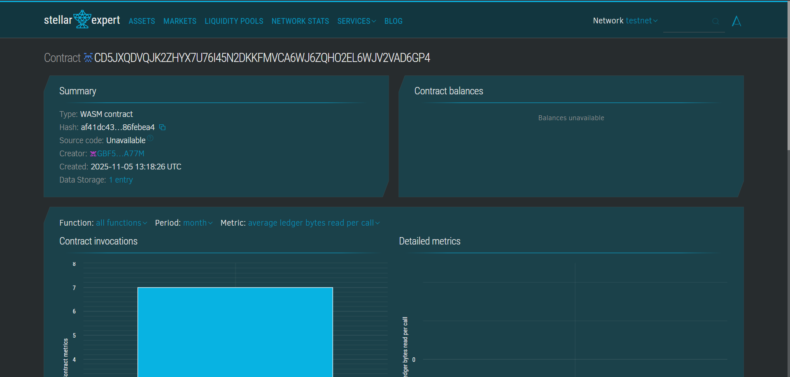

### OpenTender — Decentralized Government Tender System
# Project Description
OpenTender is a decentralized online tender and bidding system built on the Stellar blockchain using the Soroban SDK.
It enables governments, organizations, and private entities to create tenders transparently while allowing bidders to submit sealed bids securely on-chain.
The system ensures fair competition, data integrity, and accountability, reducing corruption and enhancing trust in public procurement processes.

# Project Vision
Our vision is to revolutionize tender management by leveraging blockchain technology to create a transparent, immutable, and efficient procurement ecosystem.

We aim to:
- Ensure Transparency in Public Procurement — Every tender and bid is permanently recorded on the blockchain, accessible for public verification.
- Prevent Bid Rigging and Corruption — The commit–reveal mechanism ensures that bids remain confidential until the reveal phase.
- Empower Equal Opportunity — Allow all eligible participants to compete fairly, regardless of geography or influence.
- Increase Efficiency — Automate verification, evaluation, and record-keeping through smart contracts.
- Promote Trust and Accountability — Every action is auditable and verifiable by all stakeholders.

## Key Features
1. Tender Creation
- Authorities or organizations can create tenders by defining title, description, deadlines, and minimum bid.
- Metadata (like documents, requirements, etc.) is stored on IPFS and linked through an IPFS hash.
- Deadlines for bidding and bid revelation are enforced automatically on-chain.

2. Sealed Bid Submission (Commit Phase)
- Bidders submit a hashed bid (SHA256 of bid amount + secret) to maintain confidentiality.
- The bid hash is stored immutably until the reveal phase begins.
- Prevents manipulation and ensures that bids remain private until all are revealed.

3. Bid Reveal Phase
- After the bidding deadline, participants reveal their actual bid amount and secret.
- The smart contract verifies the authenticity of each bid by matching the hash.
- Only valid and correctly revealed bids are considered.

4. Automatic Tender Closure
- Once the reveal deadline passes, the tender automatically closes.
- The system identifies the lowest valid bidder and marks them as the winner.
- Prevents post-deadline modifications or unauthorized access.

5. Event Logging & Transparency
- Every action (tender creation, bid commit, reveal, and closure) emits on-chain events.
- These logs can be tracked by anyone for full transparency.

6. Secure Authentication
- Uses Stellar’s built-in address-based authentication to verify tender creators and bidders.
- Prevents impersonation or unauthorized tender creation.

7. Frontend Integration Ready
The smart contract is designed to integrate seamlessly with a web dashboard.
Organizations can create tenders and monitor bids through a user-friendly interface.
Bidders can submit and reveal bids using wallet-connected frontends.

## Future Scope
# Short-term Enhancements (3–6 months)
- Result Dashboard: Display winning bids, bidder counts, and contract summaries.
- IPFS Document Verification: Verify authenticity of uploaded documents via hash comparison.
- Penalty Mechanism: Penalize late or invalid bid reveals.
- Tender Categories: Add tags and filters for tender types (e.g., Construction, IT, Procurement).
# Mid-term Development (6-12 months)
- Multi-Currency Support: Allow bids in different tokens supported by Stellar.
- Reputation System: Build bidder credibility based on previous performance.
- Audit Mode: Allow third-party auditors to view logs and confirm fairness.
- Dispute Resolution: Introduce arbitration smart contracts for conflicts.
- Governance Voting: Enable on-chain voting for tender-related policy changes.
# Long-term Vision (12+ months)
- Cross-Chain Bidding: Allow tenders to accept bids from other blockchain networks.
- Automated Escrow Payments: Automatically release payments to winning bidders after task completion.
- AI-Driven Analysis: Suggest fair tender prices and detect suspicious patterns.
- Decentralized Procurement Marketplace: A unified platform for all public and private tenders.
- Mobile App Integration: Enable users to view and bid on tenders from their phones.
- Regulatory Compliance Tools: Support government compliance and audit frameworks.

## Technical Details
# Smart Contract:
- Built using Rust and Soroban SDK
- Implements:
- - Tender creation (create_tender)
- - Bid commitment (commit_bid)
- - Bid reveal and verification (reveal_bid)
- - Automatic tender closure and winner selection
- Persistent storage for tenders, bids, and counters
- On-chain event system for transparency

# Contract Details

- Contract ID: CD5JXQDVQJK2ZHYX7U76I45N2DKKFMVCA6WJ6ZQHO2EL6WJV2VAD6GP4
- Network: Testnet
- Language: Rust (Soroban)

